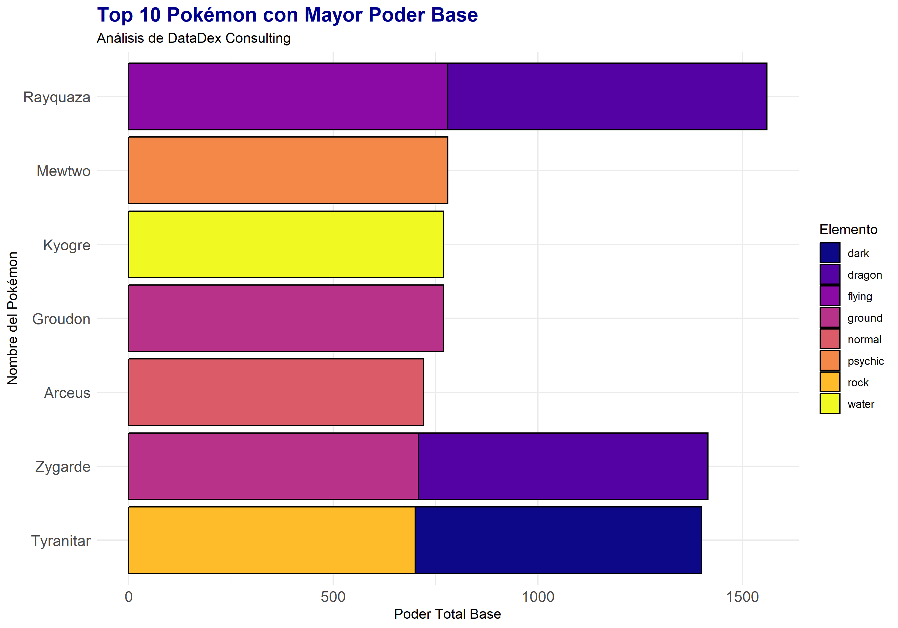

##  Análisis del Top 10: Agrupados por tipo

### Visualización

### Explicación de los Datos
Esta gráfica presenta los 10 especímenes con las estadísticas más altas de la base de datos de **DataDex**. 

* **Eje Vertical:** Muestra los nombres de los Pokémon ordenados de mayor a menor poder.
* **Eje Horizontal:** Representa la sumatoria de estadísticas base (`total_base`).
* **Colores:** Indican el tipo elemental del Pokémon para identificar tendencias de poder por categoría.

**Conclusión técnica:** La visualización confirma que el poder absoluto no está limitado a un solo tipo de elemento, lo que demuestra una distribución competitiva en el ecosistema analizado.