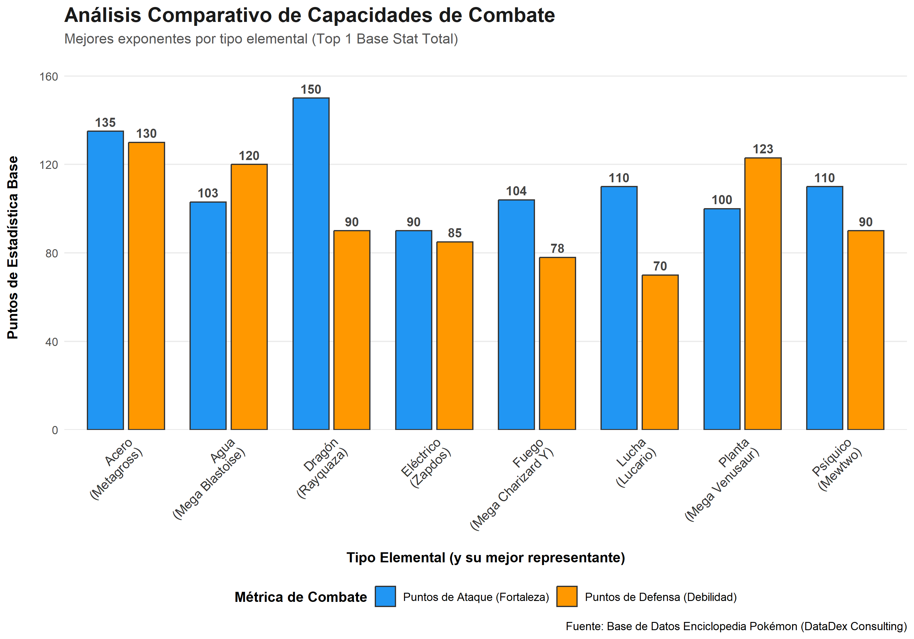

# Reporte de Visualización de Datos - DataDex

## 1. Comparativa de Capacidades de Combate
Este análisis permite identificar a los mejores exponentes por tipo elemental, evaluando su balance entre ofensiva y defensiva.

### Visualización

### Explicación Técnica
* **Formato:** Gráfico de Barras Agrupadas.
* **Eje X:** Tipo Elemental y nombre del Pokémon líder en estadísticas.
* **Eje Y:** Puntos de Estadística Base.

**Interpretación:**
* 🔵 **Azul (Fortaleza):** Puntos de Ataque.
* 🟠 **Naranja (Debilidad):** Puntos de Defensa.

> **Nota de DataDex:** Se observa que el tipo **Dragón** posee la mayor fuerza ofensiva, mientras que el tipo **Acero** ofrece el mejor balance para estrategias defensivas.